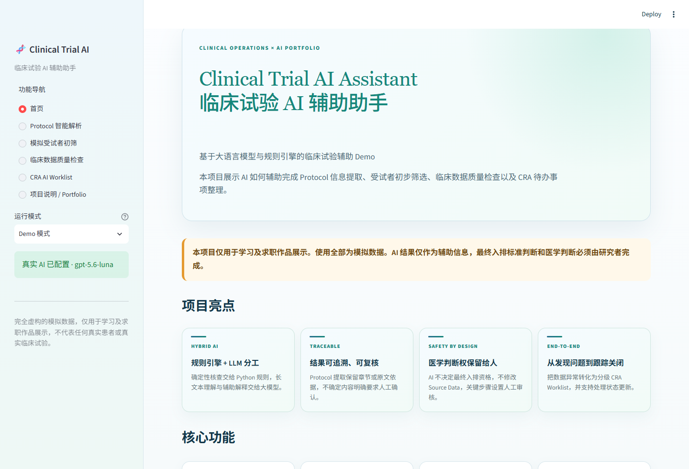
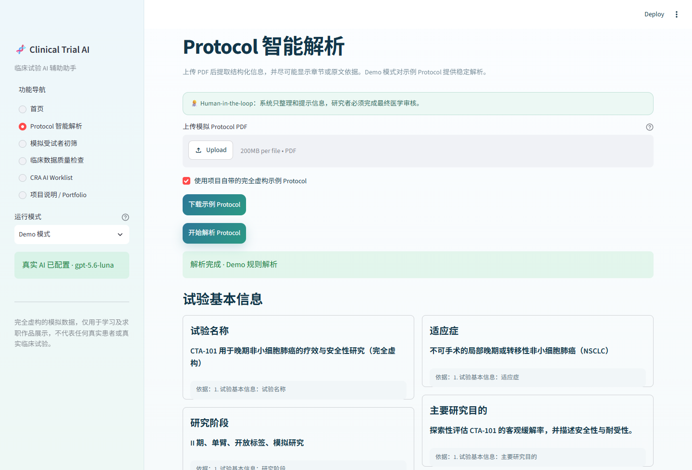
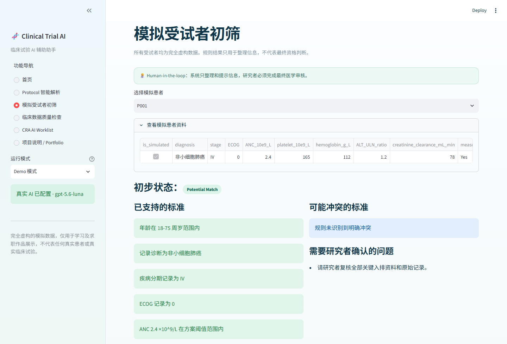
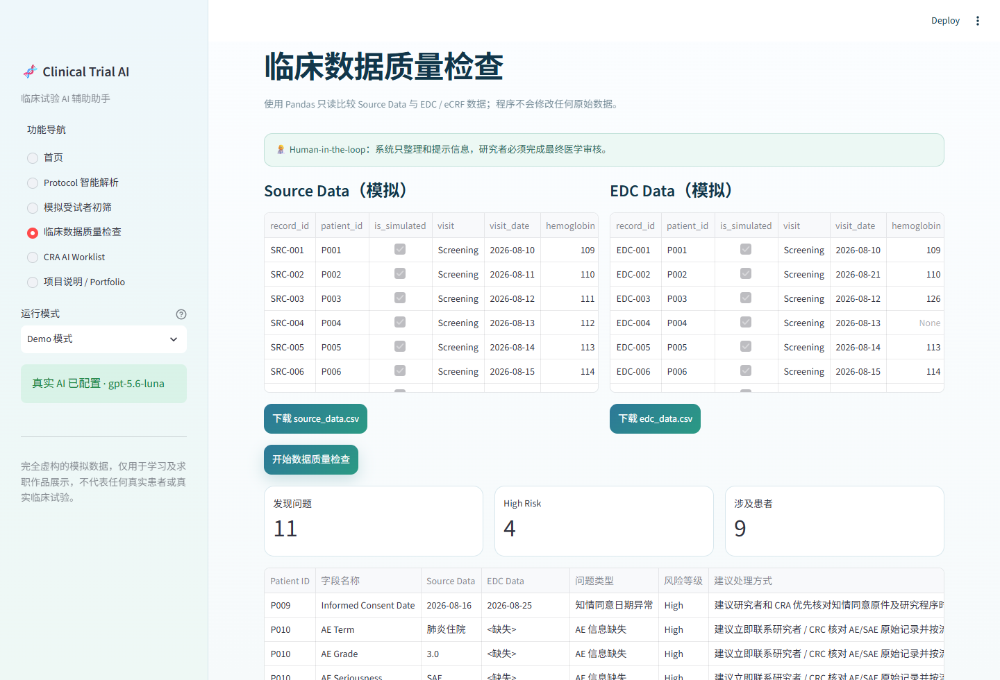
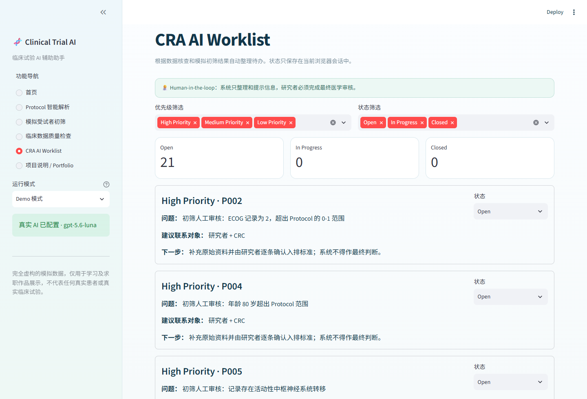
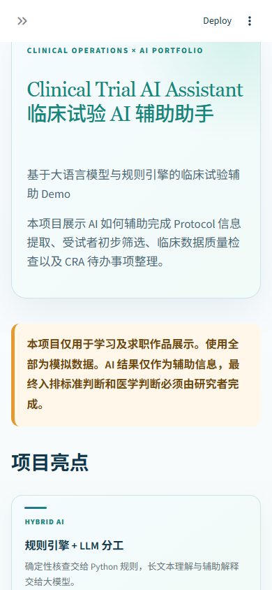

# Clinical Trial AI Assistant

> 临床试验 AI 辅助助手｜基于大语言模型、规则引擎与 Human-in-the-loop 的求职作品集 Demo

## 在线体验

**[点击打开 Clinical Trial AI Assistant](https://clinical-trial-ai-assistant-kirishinya.streamlit.app/)**

公开版本默认使用 Demo 模式，无需 API Key，可直接体验全部四项核心功能。

本项目模拟临床试验运营中的四类高频工作：Protocol 信息整理、受试者初步筛选、Source Data 与 EDC 数据核查，以及 CRA 待办事项跟踪。项目重点不是替代研究者，而是展示如何把 AI、Python 数据处理和临床试验业务流程组合成一套可解释、可复核的辅助工作流。

> **重要声明：**本项目仅用于学习及求职作品展示；全部 Protocol 和患者数据均为虚构模拟数据。AI 结果仅作为辅助信息，最终入排标准判断和医学判断必须由研究者完成。

## 业务场景

临床试验项目中，团队经常需要阅读较长的 Protocol、反复核对受试者资料、比较 Source Data 与 EDC，并持续跟踪数据疑问。上述工作包含大量重复但需要谨慎复核的步骤，适合采用“程序规则 + LLM 辅助解释 + 人工审核”的方式提高整理效率。

## 主要功能

1. **Protocol 智能解析**：读取 PDF，结构化展示试验信息、入排标准、访视计划和安全性观察，并尽可能保留章节或原文依据。无法确认的信息会标记“需要人工确认”。
2. **模拟受试者初筛**：按入排标准逐条检查虚构患者数据，只输出 `Potential Match`、`Needs Review` 或 `Potential Mismatch`，不作最终入组判断。
3. **临床数据质量检查**：用 Pandas 只读比较 Source Data 与 EDC，识别日期、实验室结果、单位、用药、AE/SAE、重复与缺失等问题。
4. **CRA AI Worklist**：把核查问题整理为分级待办，显示 Patient ID、建议联系对象、下一步动作，并支持 `Open / In Progress / Closed` 状态管理。
5. **Demo / 真实 AI 双模式**：无 API Key 也可完整演示；配置服务器端环境变量后，可使用真实大模型解析 Protocol 和生成初筛辅助解释。

## 技术架构

| 层级 | 技术 | 作用 |
|---|---|---|
| 交互界面 | Streamlit | 提供中文网页、上传、按钮、表格和状态管理 |
| 数据处理 | Python + Pandas | 读取 CSV、执行规则、比较数据、生成待办 |
| 文档解析 | pypdf | 从可检索的 Protocol PDF 读取文字 |
| 示例 PDF | ReportLab | 生成完全虚构的中文试验方案 |
| AI 能力 | OpenAI Responses API | 结构化提取与辅助解释；密钥仅在服务器端读取 |
| 质量保障 | pytest + Streamlit AppTest | 核心逻辑和页面回归测试 |

## Agent 工作流

```text
Protocol → 文档解析 → 入排标准提取 → 患者数据读取
→ 规则匹配 → LLM 辅助解释 → 人工审核 → 初筛报告

Source Data + EDC Data → 数据读取 → 字段比较 → 异常检测
→ 风险分类 → CRA Worklist → 人工确认 → 问题关闭
```

这里的 Agent 不是“自己做医学决定的机器人”，而是一条有明确输入、规则、工具、输出和人工审核节点的自动化工作流。

## 项目目录

```text
clinical-trial-ai-assistant/
├─ app.py                     # Streamlit 主程序
├─ core/                      # AI、规则、数据核查等核心逻辑
├─ data/                      # 自动生成的虚构模拟数据
├─ assets/style.css           # 页面样式
├─ scripts/                   # 数据生成与项目检查脚本
├─ tests/                     # 自动化测试
├─ screenshots/               # 项目截图位置
├─ README.md                  # 招聘方项目介绍
├─ DEMO_GUIDE.md              # 3 分钟作品演示顺序
└─ PROJECT_EXPLANATION.md     # 项目作者面试讲解稿
```

## 如何运行（适合零基础）

### Windows 双击方式

1. 第一次使用，双击 `安装依赖.bat`，等待窗口显示安装完成。
2. 以后每次只需双击 `启动项目.bat`。
3. 浏览器会打开 `http://localhost:8501`。
4. 先保持侧边栏为“Demo 模式”，即可体验全部功能。

### 命令行方式

```powershell
python -m venv .venv
.\.venv\Scripts\python.exe -m pip install -r requirements.txt
.\.venv\Scripts\python.exe scripts\generate_sample_data.py
.\.venv\Scripts\python.exe -m streamlit run app.py
```

## 配置真实 AI 模式

真实 AI 不是运行 Demo 的必要条件。需要时：

1. 复制 `.env.example` 并命名为 `.env.local`。
2. 只在本机的 `.env.local` 中填写：

```text
OPENAI_API_KEY=你的_API_Key
OPENAI_MODEL=gpt-5.6-luna
```

3. 重新启动项目，侧边栏会出现“真实 AI 模式”。

`.env.local` 已被 `.gitignore` 排除，不应上传到 GitHub。前端代码不会接收、保存或显示 API Key；调用只发生在运行 Streamlit 的服务器端。公开部署时，应在部署平台的 Secrets / Environment Variables 页面配置变量，不能把密钥写入代码。

## Demo 模式

Demo 模式不访问外部模型，使用固定规则和预设解析结果，适合面试现场稳定演示。项目包含：

- `sample_protocol.pdf`：原创虚构的 II 期晚期非小细胞肺癌试验方案。
- `patient_data.csv`：12 名虚构受试者。
- `source_data.csv` 与 `edc_data.csv`：故意设置日期、实验室、单位、用药、AE/SAE、重复和缺失等问题。

## 推荐演示顺序

完整逐分钟话术请查看 [`DEMO_GUIDE.md`](DEMO_GUIDE.md)。

1. 首页说明项目边界和两条 Agent 工作流。
2. 在 Protocol 页面使用示例 PDF，展示“原文依据”和“需要人工确认”。
3. 在初筛页面依次查看不同模拟患者，强调系统不作最终入排判断。
4. 在数据质量页面点击检查，展示高风险问题和只读原则。
5. 在 CRA Worklist 页面修改一条任务状态，说明 Human-in-the-loop 闭环。
6. 最后打开 Portfolio 页面，总结业务价值。

## 项目截图

项目截图统一放在 `screenshots/` 文件夹。可用于简历、作品集或 GitHub README；截图时请保留首页免责声明，并确保画面中没有本地密钥或个人信息。

### 首页与 Agent 工作流



### Protocol 智能解析



### 模拟受试者初筛



### 临床数据质量检查



### CRA AI Worklist



### 手机端首页



## 安全与隐私

- 所有 Protocol、患者编号和临床数据均为人工构造的模拟信息，不包含真实患者数据。
- 程序只提示异常，不修改 Source Data 或 EDC。
- AI 不进行最终医学判断，不决定受试者是否入组。
- API Key 仅从服务器端环境变量或本地忽略文件读取。
- 上传真实业务文件前，必须获得授权并完成去标识化；本 Demo 不建议处理真实患者资料。

## 未来可扩展方向

- 增加 OCR，支持扫描版 Protocol。
- 对接 CTMS / EDC 的受控测试接口。
- 增加审计日志、角色权限和电子签名。
- 支持多版本 Protocol 比较和修订影响分析。
- 增加 Query 草稿、访视窗提醒和中心风险监测。
- 使用经批准的数据治理方案部署到合规环境。

## 项目边界

这是作品集 Demo，不是医疗器械或正式临床系统，不能用于诊断、治疗、患者招募决定或任何真实临床决策。
